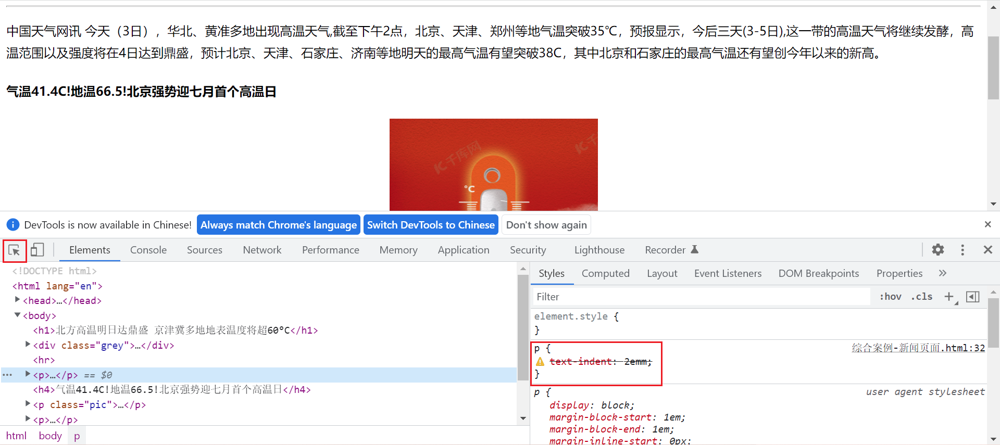

# ch01.简介与基础选择器

## 1. CSS 简介

### 1.1 HTML 的局限性

HTML 是网友的骨架，只关注内容的语义。例如`<h1>`表示大标题，`<p>`表示段落。

早期的时候，HTML 只能做一些简单的样式，网页非常丑，而且使 HTML 代码臃肿。

### 1.2 CSS-网页的美容师

**CSS** 是 **层叠样式表（Cascading Style Sheets）**的简称。

CSS 也是一种标记语言。

CSS 主要用于设置 HTML 页面中的文本内容（字体、大小、对齐方式）、图片的外形（宽高、边框样式、边距等）以及版面的布局和外观显示样式。·

HTML 呈现结构，CSS 决定样式，结构与样式分离。

### 1.3 CSS 语法规范

CSS 规则由两个部分组成：**选择器和一条或多条声明**。

### 1.4CSS 代码风格

以下不是强制规范，而是符合实际开发书写方式。

- 展开式

	```css
	h3 {
	    color: pink;
	    font-size: 20px;
	}
	```

- 选择器，属性名，属性关键字全部小写

- 空格规范：

	- 属性值前面、冒号后面保留一个空格
	- 选择器（标签）和大括号中间保留空格

## 2. CSS 基础选择器

### 2.1 选择器的作用

选择器就是根据不同需求把不同标签选择出来。

### 2.2 选择器分类

选择器分为**基础选择器**和**复合选择器**两大类。

- 基础选择器由单个选择器组成
- 基础选择器包括：**标签选择器**、**类选择器**、**id 选择器**和**通配符选择器**

### 2.3 标签选择器

直接用 **HTML 标签名**作为选择器，按标签名称分类，**为页面某一类标签指定统一的 CSS 样式。**

语法

```HTML
标签名 {
    属性1： 属性值1;
    属性2： 属性值2;
    属性3： 属性值3;
}
```

优点 标签选择器可以把某一标签**全部**选择出来，快速为同类型标签设置统一样式。

缺点 不能设置差异化样式，只能选择全部当前标签。

### 2.4 类选择器

**差异化**选择不同标签，单独选一个或者某个标签。

语法

```css
.类名 {
    属性1: 属性值1;
    ...
}
```

>```css
>.red {
>    color: red;
>}
>```

使用 **`class`** 属性来**调用** class 类。
**样式点定义，结构类调用，一个或多个，开发最常用。**

```html
<!-- 在需要用到的地方写上 class="类名" -->
<li class="red">Evan</li>
```

类选择器用 `.` 号显示。

注意

1. 类选择器用 `.` 标识，紧跟类名。
2. 小写，长名称或词组可以使用 `-` 连接单词。
3. 类名不要用纯数字、中文。
4. 命名有意义。

### 案例

使用类选择器画三个盒子

```html
<!DOCTYPE html>
<html lang="en">
<head>
    <meta charset="UTF-8">
    <meta http-equiv="X-UA-Compatible" content="IE=edge">
    <meta name="viewport" content="width=device-width, initial-scale=1.0">
    <title>利用类选择器画三个盒子</title>
    <style>
        .red {
            width: 100px;
            height: 100px;
            /* 背景颜色 */
            background-color: red;
        }
        .green {
            width: 100px;
            height: 100px;
            background-color: green;
        }
    </style>
</head>
<body>
    <div class="red">红色</div>
    <div class="green">绿色</div>
    <div class="red">红色</div>
</body>
</html>
```

### 2.4.1 类选择器-多类名

可以给一个标签指定多个类名，就是一个标签有多个名字。

1. 多类名使用方式

	```html
	<p class="class-name1 class-name2"></p>
	```

	>```html
	><div class="red font20">亚瑟</div>
	>```

	（1）在标签class属性中写多个类名

	（2）多个类名必须用**空格**分开

2. 多类名使用场景

	（1）可以把一些标签元素相同的样式放到一个类里

	（2）这些标签可以调用这个公共的类，然后再调用自己独有的类

### 2.5 id 选择器

HTML 元素以 **id 属**性来设置 id 选择器，CSS中用 **`#`** 来定义。

```HTML
#id名 {
    属性1: 属性值1;
    ...
}

<!-- 调用 -->
<div id="pink">Evan</div>
```

**样式 `#` 定义，结构 id 调用，只能调用一次，别人切勿使用。**

id 选择器与类选择器的区别

1. **类选择器可以被多个元素调用。**
2. **id 选择器只能允许一个标签调用。**
3. 类选择器使用的较多，**id 选择器用于唯一特性的标签**。

### 2.6 通配符选择器

语法

```HTML
* {
    属性1: 属性值1;
    ...
}
```

- 用 **`*`** 定义通配符选择器，选取页面中**所有标签**。
- **不需要调用，自动给所有标签。**
- 特殊情况使用

```HTML
* {
    margin: 0;
    padding: 0;
}
```

### 2.7 基础选择器总结

| 基础选择器   | 作用                 | 特点                             | 使用情况         | 用法                 |
| ------------ | -------------------- | -------------------------------- | ---------------- | -------------------- |
| 标签选择器   | 选中所有相同标签     | 不能差异化选择                   | 较多             | `p{color:red;}`      |
| 类选择器     | 选出一个或多个标签   | 可以根据需求选择                 | 较多             | `.nav {color: red;}` |
| id 选择器    | 一次只能选出一个标签 | 一个 id 属性在页面中只能出现一次 | 一般配合 js 使用 | `#nav {color: red;}` |
| 通配符选择器 | 选择所有标签元素     | 选择的太多，有部分不需要         | 特殊情况使用     | `* {color: red; }`   |

- 每个选择器都有自己的使用场景，都要掌握。
- 如果是修改样式，类选择器是使用最多的。


## 3. CSS 字体属性

### 3.1 字体系列

CSS 使用 **`font-family`** 属性定义文本字体系列。 尽量使用默认字体，保证不同浏览器的兼容性。

```css
p（标签） {
  font-family: "微软雅黑", Arial, Helvetica, sans-serif;
}
```

- 各种字体必须使用英文状态下的逗号隔开
- 如果有空格隔开的多个单词组成的字体，加引号
- 尽量使用系统默认自带字体
- 最常见的字体：`body{font-family: 'Microsoft YaHei',tahoma,arial,'Hiragino Sans GB';}`
	可以直接指定`body`字体

### 3.2 字体大小

CSS 使用 **`font-size`** 属性定义字体大小。

```css
p {
  font-size: 16px;
}
```

- **`px`**（像素） 大小是我们网页常用单位 `font-size: 16px;`

	还有**`% `** --`font-size: 150%;`

	还有预定大小，比如：small, large, x-large-- `font-size: large;`

- 谷歌浏览器默认是 `16px`

- 可以给 **`body`** 指定整个页面文字大小

- 标题标签比较特殊，需要单独指定文字大小

### 3.3 字体粗细

CSS 使用 **`font-weight`** 属性设置字体粗细

```css
p {
  font-weight: 700;
}
```

实际开发中，更常用数字来表示加粗或变细。`400`为`normal`，`700` 为 `bold`。

| 属性值  | 描述                                                     |
| ------- | -------------------------------------------------------- |
| normal  | 默认值（不加粗的）                                       |
| bold    | 定义粗体（加粗）                                         |
| 100-900 | 400等同于normal，700等同于bold。注意**数字后不跟单位**。 |

### 3.4 文字样式

CSS 使用 **`font-style`** 属性设置文本风格。

```html
p { font-style: italic; }
```

| 属性值 | 描述     |
| ------ | -------- |
| normal | 正常显示 |
| italic | *斜体*   |

注意：平常很少给字体加斜体，而是给斜体标签（em,i）给位不倾斜字体。

### 3.5 字体复合属性写法

将各种字体属性写在同一选择器下，节约代码。

规则：严格遵守**顺序**，且 **`font-size`** 和 **`font-family`** 必须有。

```css
body {
    /*font: font-style font-weight font-size/line-hight font-family;*/
    font: italic 700 16px/20px 'Microsoft yahei';
}
```

### 3.6 字体属性总结

| 字体属性    | 表示     | 注意                                 |
| ----------- | -------- | ------------------------------------ |
| font-size   | 字号     | 通常用的单位是 `px`像素              |
| font-family | 字体     | 按照团队约定来写                     |
| font-weight | 字体粗细 | 400=normal，700=bold，数字不要跟单位 |
| font-style  | 字体样式 | italic，normal，常用 normal          |
| font        | 属性连写 | 顺序不能变，字体和字号属性必须有     |

## 4. CSS 文本属性

CSS Text（文本）属性定义文本外观，比如颜色、对齐、装饰、缩进、行间距等。

### 4.1 文本颜色

**`color`** 属性定义文本颜色。

```css
div {
  color: red;
}
```

| 表示           | 属性值                        |
| -------------- | ----------------------------- |
| 预定义的颜色值 | red,green,blue,pink...        |
| 十六进制       | #FF0000, #FF6600, #29D794     |
| RGB代码        | rgb(255,0,0)或rgb(100%,0%,0%) |

实际开发中，最常用的是十六进制。

**`background-color`**用于设置元素的背景颜色

### 4.2 对齐文本

**`text-align`** 属性用于设置元素文本内容的对齐方式。

```css
div {
  text-align: center;
}
```

| 属性值 | 解释           |
| ------ | -------------- |
| left   | 左对齐（默认） |
| right  | 右对齐         |
| center | 居中对齐       |

### 4.3 装饰文本

**`text-decoration`** 属性规定添加到文本的修饰。可以给文本添加下划线、删除线、上划线等。

```css
text-decoration: underline;
```

| 属性值       | 描述                       |
| ------------ | -------------------------- |
| none         | 默认，无装饰（最常用）     |
| underline    | 下划线，a 标签自带（常用） |
| overline     | 上划线。（几乎不用）       |
| line-through | 删除线。（不常用）         |

### 4.4 文本缩进

**`text-indent`**定义段落首行缩进。

```css
p {
  text-indet: 5px;
}
```

`em` 是一个相对单位，`1em` 就是一个字符所占大小。当 `text-indent=2em`，则恰好缩进两个文字。

### 4.5 行间距

**`line-height`** 设置行间的距离，行间距=文本高度+上间距+下间距

```css
p {
    line-height: 26px;
}
```

### 4.6 文本属性总结

| 属性            | 表示     | 注意                     |
| --------------- | -------- | ------------------------ |
| color           | 文本颜色 | 通常十六进制缩写         |
| text-align      | 文本对齐 |                          |
| text-indent     | 文本缩进 | 记住 `text-indent: 2em;` |
| text-decoration | 文本装饰 | 记住下划线和去除下划线   |
| line-height     | 行高     |                          |

## 5. CSS 引用方式

按照 CSS 书写的位置不同，CSS 样式表可以分为三大类：

1. 行内样式表（行内式）
2. 内部样式表（嵌入式）
3. 外部样式表（链接式）

### 5.1 内部样式表

<u>将 CSS 代码写在 HTML 页面内部</u>，单独放在一个 **`<style>`** 标签中。

```html
<style>
    div {
        color: red;
        font-size: 12px;
    }
</style>
```

- `<style>` 理论上可以放在 HTML 文档中任何一个地方，一般放在 **`<head>`** 标签中。
- 方便控制整个页面中的元素样式。
- 代码结果清晰，没有实现结构样式完全分离。

练习时使用，<u>实际开发不用</u>。

### 5.2 行内样式表

行内样式表（内联样式表）是在<u>元素标签内部的 `style` 属性中设定 CSS 样式</u>，适合修改<u>简单样式</u>。

```html
<div style="color: red; font-size: 12px">行内样式表</div>;
```

- 设置当前标签样式
- 书写繁琐，不推荐大量使用。

### 5.3 外部样式表

实际开发中都是外部样式表，适用于样式比较多的情况。 核心：样式单独写到 CSS 文件中，再将 CSS 文件引入到 HTML 页面中。

1. 新建一个后缀名为 .css 的样式标签，放所有的CSS代码
2. 在HTML页面中，使用`<link>`标签引入这个文件。（输入link按Tab键）

```html
<link rel="stylesheet" href="css文件路径" />
```

| 样式表                      | 优点                   | 缺点         | 使用情况 | 控制范围 |
| --------------------------- | ---------------------- | ------------ | -------- | -------- |
| 行内样式表 inline styling   | 书写方便，权重高       | 混写         | 较少     | 一个标签 |
| 内部样式表 internal styling | 部分结构和样式分离     | 没有彻底分离 | 较多     | 一个页面 |
| 外部样式表 external styling | 完全实现结构和样式分离 | 需要引入     | 最多     | 多个页面 |

## 6. 综合案例

新闻页面

## 7. Chrome调试工具

1. 打开调试工具

	打开Chrome浏览器，按下F12键或右击页面空白处→检查

2. 使用调试工具

	①Ctrl+滚轮可以放大开发者工具代码大小
	②左边是HTML元素结构，右边是CSS样式
	③右边CSS样式可以改动数值(左右头或者直接输入)和查看颜色
	④ Ctrl + 0 复原浏览器大小
	⑤如果点击元素，发现右侧没有样式引入，极有可能是类名或者样式引入错误
	⑥如果有样式，但是样式前面有黄色叹号提示，则是样式属性书写错误

	

	点击左边红框内的鼠标，点击需要查看的对应内容的地方，底下会跳转，右边红框内的删除线表示错误的内容，需要修改。


# ch02. 复合选择器与特性

## 1. Emmet 语法

- 快速生成 HTML 结构代码

	1. 生成标签直接输入标签名按tab键即 比如 div 然后tab键，就可以生成`<div></div>`

	2. 如果想要生成多个相同标签加上就可以了比如 div*3（中间不要有空格）然后tab键就可以快速生成3个div

	3. 如果有父子级关系的标签，可以用 > 比如 ul>li就可以了（生成`ul`包含`li`）

	4. 如果有兄弟关系的标签，用+ 就可以了比如div+p

	5. 如果生成带有类名或者id名字的，直接写 .demo（类，demo指对应的类名） 或者 #two（id，two指id名） tab键就可以了，生成的是`<div class="demo"></div>`和`<div id="two"></div>`

		如果要生成`<div>`以为的，输入`p.one`按tab键生成`<p class="one"></p>`

	6. 如果生成的div类名是有顺序的，可以用自增符号$

		输入`.demo$*5`按tab键生成

		```html
		<div class="demo1"></div>
		<div class="demo2"></div>
		<div class="demo3"></div>
		<div class="demo4"></div>
		<div class="demo5"></div>
		<!--不带$的生成的5个都是demo-->
		```

	7. 如果想要在生成的标签内部写内容可以用{}表示

		输入`div{啦啦啦}`按tab键生成`<div>啦啦啦</div>`

- 快速生成 CSS 样式代码

	CSS基本采取简写的形式

	1. 比如 w200 按tab生成 `width: 200px;`
	2. 比如 lh26 按tab生成 `line-height: 26px;`
	3. 比如 tac 按tab生成 `text-align: center;`

## 2. 复合选择器

由基础选择器组合而成。

- 后代选择器
- 子选择器
- 并集选择器
- 伪类选择器

### 2.1 后代选择器（重要）

后代选择器又称为<u>包含选择器</u>，可以**选择父元素里的子元素**。写法是将外层标签写在前面，内层标签写在后面，中间空格分开。 语法

```CSS
元素1 元素2 { 样式声明; }
```

>```css
>ol li {
>    color: pink;
>}
>```

- 上述语法表示<u>选择元素 1 里面所有的元素 2</u>

- 可以<u>连续嵌套</u>，比如可以是孙子等

- 元素 1、2 可以是任何基础选择器

	>```html
	><ul>
	>    <li>我是ul的孩子</li>
	>    </ul>
	><ul class="nav">
	>    <li>我是ul的孩子</li>
	>    <li><a href="#">我是孙子</a></li>
	>    <li><a href="#">我是孙子</a></li>
	></ul>
	>```
	>
	>只改nav类里li的a：
	>
	>```css
	>.nav li a {
	>    color: yellow;
	>}
	>```

### 2.2 子选择器（重要）

子元素选择器（子选择器）只能选择作为**元素的最近一级子元素**。简单理解就是选亲儿子。

**语法**：表示选择元素1里所有直接后代（子元素）元素2.

```CSS
元素1 > 元素2 { 样式声明; }
```

- 元素之间用大于号 `>` 隔开
- 1 为父级。二为子级，最终选择的是元素 2
- 元素 2 必须是亲儿子，不包含孙子重孙子等。

### 2.3 并集选择器

并集选择器可以选择**多组标签**，同时为他们定义**相同的样式**。通常用于集体声明。

并集选择器是各选择器通过英文逗号 **`,`** 连接而成，任何形式的选择器都可以作为并集选择器的一部分。

约定的语法规范，并集选择器竖着写

**语法**

```css
元素1, 元素2 { 样式声明; }
```

>```css
>ul, 
>div {
>    样式声明;
>}
>```

### 2.4 伪类选择器

伪类选择器用于向某些选择器添加特殊的效果。 伪类选择器书写最大特点是用冒号 **`:`** 表示。 伪类选择器种类多，比如链接伪类选择器、结构选择器等。

#### 2.4.1 链接伪类选择器

```css
a:link /*选择所有未被访问的链接*/
a:visited /*选择所有已被访问的链接*/ /*有的链接点过后再回去页面看链接会变色*/
a:hover /*选择鼠标指针位于其上的链接*/
a:active /*选择活动链接（鼠标按下未弹起的链接）*/
```

冒号前后不要有空格

**注意事项**

1. 确保样式生效，要**按照 LVHA 的顺序**声明：link,visited,hover, active。
2. a 链接在浏览器中有默认样式，所以实际开发<u>都需要给链接单独指定样式</u>。

**开发中实际写法**

```css
a {
  color: gray;
  text-decoration: none;
}
a:hover {
  color: #369;
  text-decoration: underline;
}
```

#### 2.4.2 focus 伪类选择器

**`:focus` 伪类选择器**用于获取**焦点**的**表单元素**。 焦点就是光标，一般情况 `<input>` 类表单元素才能获取，因此这个选择器也主要针对表单元素来说。

```css
input:focus {
  background-color: yellow;
}
```

#### 2.4.3 其他标准伪类选择器

1. `first-child`

	`:first-child` 是 CSS 伪类，表示父元素的第一个子元素。

2. `last-child`

	`:last-child` CSS 伪类 代表父元素的最后一个子元素。

3. `nth-child(n)`

```
:nth-child(an+b)` 这个 CSS 伪类首先找到所有当前元素的兄弟元素，然后按照位置先后顺序从 1 开始排序，选择的结果为 CSS 伪类 `:nth-child`括号中表达式 `(an+b)` 匹配到的元素集合 `(n=0，1，2，3...)
```

4. `:not(p)`

	`:not()` 用来匹配不符合一组选择器的元素。由于它的作用是防止特定的元素被选中，它也被称为反选伪类（negation pseudo-class）。

5. `::after (:after)`

	CSS 伪元素 `::after` 用来创建一个伪元素，作为已选中元素的最后一个子元素。通常会配合 `content` 属性来为该元素添加装饰内容。这个虚拟元素默认是行内元素。

```css
.exciting-text::after {
  content: "<- 让人兴兴兴奋!";
  color: green;
}Copy to clipboardErrorCopied
```

我们几乎可以用想要的任何方法给 `content` 属性里的文字和图片的加上样式.

6. `::before (:before)`

	CSS 中，`::before` 创建一个伪元素，其将成为匹配选中的元素的第一个子元素。常通过 `content` 属性来为一个元素添加修饰性的内容。此元素默认为行内元素。 使用 `::before` 伪元素的一个简单示例就是用于加入引号。

	HTML

```HTML
<q>一些引用</q>, 他说, <q>比没有好。</q>.Copy to clipboardErrorCopied
```

​		CSS

```css
q::before {
  content: "«";
  color: blue;
}
q::after {
  content: "»";
  color: red;
}
```

### 2.5 复合选择器总结

| 选择器         | 作用                   | 特征             | 使用情况 | 隔开符号及用法             |
| -------------- | ---------------------- | ---------------- | -------- | -------------------------- |
| 后代选择器     | 用来选择后代元素       | 可以是子孙后代   | 较多     | 符号是空格 `.nav a`        |
| 子代选择器     | 选择最近一级元素       | 只能选亲儿子     | 较少     | 符号是大于 `.nav>p`        |
| 并集选择器     | 选择某些相同样式的元素 | 可以用于集体声明 | 较多     | 符号是逗号，`.nav, a`      |
| 链接伪类选择器 | 选择不同状态的链接     | 跟链接相关       | 较多     | 重点记住`a{}`和`a:hover{}` |
| :focus 选择器  | 选择获得光标的表单     | 跟表单相关       | 较少     | 记住`input:focus`用法      |


## 3. 元素显示模式

### 3.1 什么是元素显示模式

作用：网页的标签非常多，不同地方使用不同，了解其特点可以更好布局。

HTML 元素分为**块元素**和**行内元素**。

### 3.2 块元素

常见的块元素有 `h1-h6`、`p`、`div`、`ul`、`ol`、`li`等。 块级元素的特点：

1. <u>独占一行</u>。
2. 高度、宽度、外边距以及内边距都可以控制。
3. 宽度默认是容器（父级宽度）的 100%。
4. 是一个容器及盒子，里面可以放<u>行内或块级元素</u>。

注意：

- <u>文字类的标签内不能放块级元素</u>。
- 文字类元素有 `p`，`h1-h6`，尤其不能放 `div` 元素。

### 3.3 行内元素

常见行内元素：`a`、`strong`、`b`、`em`、`i`、`del`、`s`、`ins`、`u`、`span`，典型行内元素是 **`span`**，行内元素也叫**内联元素**。

行内元素的特点：

1. 相邻行内元素在一行上，<u>一行可以显示多个</u>。
2. <u>高、宽直接设置是无效的</u>。
3. 默认宽度就是它本身内容宽度。
4. <u>行内元素只能容纳文本或其他行内元素</u>。

**注意**

- a 链接里面不能再放链接
- 特殊情况<u>链接 a 里面可以放块级元素</u>，但是给 a 转换一下块级模式最安全。

### 3.4 行内块元素

在行内元素中有几个特殊标签——``, `<input/>`、`<td>`，它们<u>同时具有块元素和行内元素的特点</u>。有些资料称为行内块元素。

行内块元素的特点：

1. 和相邻元素（行内块）在一行上，之间存在<u>空白缝隙</u>，<u>一行可以显示多个</u>。
2. <u>默认宽度</u>是本身内容宽度。
3. <u>高度、行高、外边距、内边距都可以控制</u>（块级元素特点）。

### 3.5 元素显示模式总结

| 元素模式   | 元素排列                   | 设置样式           | 默认宽度     | 包含                                                         |
| ---------- | -------------------------- | ------------------ | ------------ | ------------------------------------------------------------ |
| 块级元素   | 一行只能放一个块级元素     | 可以设置高度宽度   | 容器的 100%  | 容器级可以包含任何标签（文字类的标签内不能放块级元素）       |
| 行内元素   | 一行可以放多个行内元素     | 不可以设置宽度高度 | 本身内容宽度 | 容纳文本或者其他行内元素（特殊情况链接 a 里面可以放块级元素） |
| 行内块元素 | 一行可以放置多个行内块元素 | 可以设置高度宽度   | 本身内容宽度 |                                                              |

### 3.6 元素模式转换

特殊情况下，需要将一个元素的模式转换为另外一宗模式，使其具有另外一种模式的特性。 比如想要增加链接 a 的触发范围。

行内元素可以转换为块元素，块元素也能转换为行内元素。

- 行内->块级 `display: block;`

```css
a {
  display: block;
}
```

- 块级->行内

```css
div {
  display: inline;
}
```

- 行内/块级-> 行内块元素

```css
span {
  display: inline-block;
}
```

### 3.7 一个小技巧——单行文字垂直居中

解决方案：让文字的行高 `line-height` 等于盒子的高度。

原理分析：行高=文字本身高度+上空隙+下空隙=盒子高度

当行高小于盒子高度，则文字偏上；当行高大于盒子高度，文字偏下。

## 4. CSS 的背景

CSS 背景属性可以给元素添加背景样式。

背景属性可以设置背景颜色、背景图片、背景平铺、背景图片位置、背景图像固定等。

### 4.1 背景颜色

`background-color` 定义了元素的背景颜色。

```css
background-color: 颜色值;
```

一般而言，颜色默认值是 `transparent`（透明），我们也可以指定背景颜色为透明色或其他色。

### 4.2 背景图片

**`background-image`** 属性描述了元素的背景图像，实际开发用于 logo 或者一些装饰性开发的小图片或者是超大的背景图片，优点是便于控制位置。（也用于精灵图）

```css
background-image: none | url(图片url);
```

>| 是指或者

| 参数值 | 作用                           |
| ------ | ------------------------------ |
| none   | 无背景图（默认）               |
| url    | 使用绝对或相对地址指定背景图像 |

### 4.3 背景平铺

若需要在 HTML 页面上对背景图进行平铺，可以使用 **`background-repeat`** 属性。

```css
background-repeat: repeat /*(默认)背景图像在纵向和横向上平铺*/ | no-repeat /*不平铺*/ | repeat-x /*沿着x轴平铺*/ | repeat-y /*沿着y轴平铺*/;
```

>默认情况下会铺满盒子

页面元素·既可以添加背景图片，也可以添加背景颜色，图片会覆盖颜色。

### 4.4 背景图片位置

**`background-position`** 可以改变图片在背景中的位置。

```css
background-position: x y;
```

参数 x 和 y 指 x 坐标和 y 坐标，可以使用<u>方位名词</u>或者<u>精确定位</u>。

| 参数值   | 说明                                                   |
| -------- | ------------------------------------------------------ |
| length   | 百分数 / 由浮点数字和单位字符组成的长度值              |
| position | top / center / bottom / left / center / right 方位名词 |

**1.参数是方位名词**

- 若两个值都是方位名词，则两个值前后顺序无关，比如`left top`和`top left` 效果一致。
- 若只指定了一个方位名词，另一个值省略，<u>则第二个值默认居中对齐</u>。

**2.参数是精确单位**

- 第一个必定是 <u>x 坐标</u>。第二个是 <u>y 坐标</u>
- 若只指定一个数值，则<u>另一个必定是 y 轴居中</u>

**3.参数是混合单位**

- 若是<u>混合单位</u>，则<u>第一个值是 x 坐标，第二个值是 y 坐标</u>。

### 4.5 背景图像固定

**`background-attachment`** 属性设置背景图像是否随着页面其余部分滚动。

`background-attachment` 后期可以制作视差滚动效果。

```css
background-attachment: scroll | fixed;
```

| 参数           | 作用                     |
| -------------- | ------------------------ |
| scroll（默认） | 背景图像随着对象内容滚动 |
| fixed          | 背景图像固定             |

### 4.6 背景属性复合写法

简化代码，将属性写在同一个属性 `background` 下。 一般按照约定顺序编写。

background 背景颜色 背景图片地址 背景平铺 背景图像滚动 背景图片位置

```css
background: transparent url(image.jpg) repeat-y fixed top;
```

### 4.7 背景颜色半透明

CSS3 提供 **`background: rgba(r,g,b,a)`** 属性设置图片透明度。

```css
background: rgba(0, 0, 0, 0.3);
```

- 最后一个参数是alpha透明度，取值范围在0~1之间（0是完全透明，1是完全不透明）
- 习惯把0.3的0省略，写为`background: rgba(0,0,0,.3);`
- 注意：背景半透明是指盒子背景半透明，盒子里面的内容不受影响
- CSS3 新增属性，IE9+支持


## 5. CSS 的三大特性

CSS 有三个非常重要的特性：层叠性、继承性、优先级。

### 5.1 层叠性

<u>相同选择器设置相同的样式</u>，此时一个样式就会覆盖另一个冲突的样式。层叠性主要解决样式冲突的问题。

层叠性原则：

- 样式<u>冲突</u>：遵循的原则是<u>就近原则</u>，哪个样式离结构近，就执行哪个样式
- 样式不冲突，不会层叠

### 5.2 继承性

CSS 中<u>子标签会继承父标签的某些样式</u>，如文本颜色和字号。

```html
    <style type="text/css">
        div {
            color: red;
            font-size: 18px;
        }
    </style>
</head>
<body>
    <div>
        <p>文本颜色</p>
    </div>
</body>
```

>指定的是div，div里的p也会继承样式

- 恰当使用继承可以简化代码，降低 CSS 的复杂性
- 子元素可以继承父元素的样式（<u>text-, font-, line-这些元素开头的可以继承，以及 color 属性</u>）

#### 5.2.1 行高的继承性

```css
body {
  font: 12px/1.5 Microsoft Yahei;
}
```

- 行高可以跟单位也可以不跟
- 如果子元素没有设置行高，则会继承父元素的行高为 1.5
- 此时子元素的行高是：<u>当前子元素的文字大小*1.5</u>
- body 行高 1.5 这样写法最大优势就是里面的子元素可以根据文字大小自动调整行高

### 5.3 优先级

当一个元素指定多个选择器时，就会有有优先级的产生。

- 选择器相同，则执行层叠性（上面的就近原则）
- 选择器不同，则根据<u>选择器权重</u>执行

选择器权重如下所示。

| 选择器                      | 选择器权重 |
| --------------------------- | ---------- |
| 继承或者`*`（通配符选择器） | `0,0,0,0`  |
| 元素（标签）选择器          | `0,0,0,1`  |
| 类选择器，伪类选择器        | `0,0,1,0`  |
| ID 选择器                   | `0,1,0,0`  |
| 行内样式 `style=""`         | `1,0,0,0`  |
| `!important`                | ∞ 无穷大   |

>权重没有进位，不是二进制的加减

```css
p {
  color: pink !important;
}
```

注意

- 可以理解为类选择器永远大于元素选择器，id选择器永远大于类选择器，以此类推。

- <u>**继承的权重为 0**，如果该元素没有直接选中，不管父元素权重多高，子元素得到的权重都是0</u>。
- <u>a 链接，浏览器默认指定了一个样式，蓝色，下划线，不会继承父级样式</u>

**复合选择器权重的叠加**

>- div ul li --> 0,0,0,3
>- .nav ul li --> 0,0,1,2
>- a:hover --> （标签+伪类）--> 0,0,1,1
>- .nav a --> 0,0,1,1

权重可以叠加，需要计算权重，但是没有进位。注意：继承的权重是0。


# ch03. 盒子模型

## 1. 盒子模型

页面布局三大核心：盒子模型，浮动，定位。

### 1.1 看透网页本质

网页布局过程：

1. 准备网页元素，网页元素基本都是盒子 box
2. 利用 CSS 设置好盒子样式，然后摆放到相应位置。
3. 往盒子里放东西。

本质：利用 CSS 摆盒子。

### 1.2 盒子模型（Box Model）组成

CSS 盒子模型本质上是一个盒子，封装周围的 HTML 元素，包括：边框border、外边距margin、内边距padding和实际内容content。


### 1.3 边框（border）

border 可以设置元素边框。边框有三个组成：`border-width`、`border-style`、`border-color`

语法

```css
/*属性可连写*/
border: border-width || border-style || border-color;
```

| 属性         | 作用                                        |
| ------------ | ------------------------------------------- |
| border-width | 定义边框粗细，单位 px                       |
| border-style | 边框样式，solid实线，dashed虚线，dotted点线 |
| border-color | 边框颜色                                    |

**边框属性简写**

```css
/*没有顺序要求，习惯顺序：*/
border: 5px solid pink;
```

**边框属性分写** top bottom left right

```css
/*注意层叠性*/
border-top: 1px solid red; /*只设定上边款，其余同理*/
```

>给一个200*200的盒子，上边框为红色，其余边框为蓝色
>
>```css
>div {
>    width: 200px;
>    height: 200px;
>    boder: 1px solid blue;
>    /*层叠性，层叠了上边框*/
>    boder-top: 1px solid red;
>}
>```

### 1.4 表格的细线边框

**`border-collapse`** 属性控制浏览器绘制表格边框的方式。它控制相邻单元格的边框。

语法

```css
border-collapse: collapse;
```

- collapse 是合并的意思
- `border-collapse:collapse;` 表示将相邻边框合并在一起

### 1.5 边框会影响盒子实际大小

边框会额外增加盒子的实际大小，因此有两种方案解决。

1. 测量盒子大小的时候，不测边框。
2. 若测量的时候包含了边框，则需要 width/height - 边框宽度。

### 1.6 内边距 padding

**`padding`** 属性设置内边距，即<u>边框与内容</u>之间的距离。

- `padding-left`: 左内边距
- `padding-right`: 右内边距
- `padding-top`: 上内边距
- `padding-bottotm`: 下内边距

**padding 属性简写**

`padding` 的值的个数：

- 1 个值：上下左右
- 2 个值：上下，左右
- 3 个值：上，左右，下
- 4 个值：<u>上，右，下，左，顺时针</u>

**padding 会影响盒子实际大小**

当给盒子指定了 `padding` 值以后，发生了两件事情：

1. 内容和边框有了距离，增加内边距
2. padding 值影响了盒子实际大小

也就是说，当盒子已经有了宽度和高度，再指定内边距，会撑大盒子。要保证盒子和效果图一样大，则让 `width/height` - 多出来的内边距大小即可。

>案例：新浪导航栏
>
>padding内边距可以撑开盒子，因为每个导航栏里的字数不一样多，可以不用给每个盒子宽度，直接给padding。

<u>如果盒子本身没有指定width/height属性，则此时padding不会撑开盒子大小</u>。

### 1.7 box-sizing 属性解决方案

CSS 中的 `box-sizing` 属性定义了 `user agent` 应该如何计算一个元素的总宽度和总高度。

在设置了一个盒子的 `width/height` 后，再设置其 `border/padding` 会影响盒子实际大小。当进行响应式布局时，这个尤其烦人。

box-sizing 属性可以被用来调整这些表现。

- `content-box`是默认值。如果你设置一个元素的宽为`100px`宽，那么这个元素的内容区会有`100px`宽，并且任何边框和内边距的宽度都会被增加到最后绘制出来的元素宽度中。

```css
box-sizing: content-box;
```

- `border-box`告诉浏览器：你想要设置的边框和内边距的值是包含在`width`内的。也就是说，如果你将一个元素的`width`设为`100px`，那么这 100px 会包含它的`border`和`padding`，内容区的实际宽度是`width`减去`(border + padding)`的值。大多数情况下，这使得我们更容易地设定一个元素的宽高。

	 ```css
box-sizing: border-box;
	```
	
	尺寸计算公式：

	```
width = border + padding + 内容的宽度
	```
	
	```
height = border + padding + 内容的高度
	```

若盒子没有指定 `width/height` 属性，则此时 `padding` 不会撑开盒子大小。

### 1.8 外边距 margin

**`margin`** 属性用于设置外边距，即控制盒子与盒子之间的距离。

- `margin-left`: 左外边距
- `margin-right`: 右外边距
- `margin-top`: 上外边距
- `margin-bottotm`: 下外边距

`margin` 简写方式与 `padding` 一致。

### 1.9 外边距典型应用

外边距可以让<u>块级</u>盒子**水平居中**，但是必须满足两个条件：

1. 盒子<u>必须指定宽度（width）</u>
2. 盒子**左右的外边距**都设置为 **`auto`**

```css
.header {
  width: 960px;
  margin: 0 auto;
}
```

常见的写法，以下三种都可以：

- margin-left:auto; margin-right:auto;
- margin:auto;
- margin:0 auto; （上下 左右）

注：以上方法是让块级元素水平居中，使行内元素或行内块元素水平居中给其父元素添加`text-align:center`即可。

```css
text-align: center;
```

### 1.10 外边距合并

#### 1. 相邻元素垂直外边距的合并

当上下相邻块元素相遇时，若上面的元素有下外边距，下面的元素有上外边距，则他们之间的垂直间距不是 `margin-bottotm` 与 `margin-top` 之和。取两个值中的较大者这种现象被称为相邻元素垂直外边距的合并。

垂直方向上相邻的块元素才会有外边距合并的问题。具体体现在上面的元素有下外边距margin-bottom，下面的元素有上外边距margin-top，两个元素最终的垂直外边距并不等于margin-bottom和margin-top之和（俩值都是正值），而是取俩值中较大者。

考虑margin支持负数，实际相邻块元素垂直外边距的结果：

- 俩都是正值，取俩值中较大者
- 俩值一正一负，取俩值的和
- 俩值都是负值，取绝对值较大者


#### 2. 嵌套块元素垂直外边距的塌陷

对于两个嵌套关系的块元素，父元素有上外边距同时子元素也有上外边距，此时父元素会塌陷较大的外边距值。

解决方案

1. 为父元素定义上边框（border/border-top)
2. 为父元素定义上内边距
3. 为父元素添加 **`overflow:hidden`** （盒子不会变大）

还有浮动、固定，绝对定位的盒子不会有塌陷问题，后续讲。

### 1.11 清除内外边距

网页元素很多都带有默认内外边距，而且不同浏览器默认的也不一致，因此在布局前，要先清除网页元素的内外边距。

语法

```css
* {
  margin: 0;/*清除外边距*/
  padding: 0;/*清除内边距*/
}
```

注意：行内元素为了照顾兼容性，尽量只设置左右内外边距，不要设置上下内外边距。但是转换为块级和行内块元素就可以设置。

### 1.12 去掉`li`项目前面的小圆点（新知识点）

语法

```css
line-style: none;
```


## 2. PS 基本操作

- 文件->打开：打开测量的图片
- Ctrl+r ：打开标尺，或者视图->标尺
- 鼠标拖动标尺可将标尺移动到PS图片上
- 右击标尺，将单位改为像素
- Ctrl+-：放大/缩小视图
- 按住空格键，鼠标可以拖动PS视图
- 用选区拖动，可以测量大小
- Ctrl+D 可以取消选区，或者在旁边空白处点击一下也可以取消选区


## 3. 圆角边框

CSS3 新增 **圆角边框** 属性，盒子可以变成圆角。

**`border-radius`** 属性用于设置元素的外边框圆角。

语法

```css
border-radius: length;
```

原理:（椭）圆与边框的交集形成的圆角效果。

参数

- 参数值可以为<u>数值</u>或<u>百分比</u>的形式
- 若是<u>正方形</u>，想要设置一个<u>圆</u>，则将数值修改为高度或者宽度的一般即可，或者直接写为 <u>50%</u>
- 若是<u>矩形</u>，想要<u>圆角矩形</u>，设置为高度height 的一半就可以做
- 简写属性，跟四个值，分别代表<u>左上角、右上角、右下角、左下角</u>（顺时针）
	如果是两个值，分别为 左上角右下角、右上角左下角
- 分开来写：`border-top-left-radius`、`border-top-right-radius`、`border-bottom-right-radius`、`border-bottom-left-radius`


## 4. 盒子阴影

CSS3 新增盒子阴影，使用 **`box-shadow`** 属性。

语法

```css
box-shadow: h-shadow v-shadow blur spread color inset;
```

| 值       | 描述                                           |
| -------- | ---------------------------------------------- |
| h-shadow | 必需，水平阴影的位置，允许负值                 |
| v-shadow | 必需，垂直阴影的位置，允许负值                 |
| blur     | 可选，模糊距离                                 |
| spread   | 可选，阴影的尺寸                               |
| color    | 可选，阴影的颜色                               |
| inset    | 可选，将外部阴影改为内部阴影（默认是外部阴影） |

注意：

1. 默认是外阴影，但是<u>不可以写这个单词（outset）</u>
2. 盒子阴影不占空间，不会影响其他盒子排列


## 5. 文字阴影

CSS3 中，使用 **`text-shadow`** 属性设置文本阴影。

```css
text-shadow: h-shadow v-shadow blur color;
```

| 值       | 描述                           |
| -------- | ------------------------------ |
| h-shadow | 必需，水平阴影位置。允许负值。 |
| v-shadow | 必须，垂直阴影。允许负值。     |
| blur     | 可选，模糊距离。               |
| color    | 可选，阴影颜色。               |


# ch04. CSS 浮动

## 1. 浮动（float）

### 1.1 传统网页布局方式

网页布局的本质——用 CSS 来摆放盒子，把盒子放到相应位置。

CSS 提供了三种传统布局方式：

- 普通流（标准流）
- 浮动
- 定位

### 1.2 标准流（普通流/文档流）

所谓的标准流，就是标签按照规定好的默认方式排列。

1. 块级元素会独占一行，从上到下顺序排列 
	- 常用元素：div、hr、p、h1-h6、ul、ol、dl、form、table
2. 行内元素会按照顺序，从左到右顺序排列，碰到父元素边缘则自动换行。 
	- 常用元素：span、a、i、em

标准流是最基本的布局方式。

以上三种方式都是来摆放盒子的，盒子摆到合适位置，布局自然就完成了。

实际开发中，一个页面基本包含三种布局方式。

### 1.3 为什么需要浮动？

很多布局效果，标准流没办法完成，此时就可以利用浮动完成布局。浮动可以改变元素标签默认排列方式。

浮动最典型应用：让多个块级元素一行显示。

网页布局第一准则：**多个块级元素纵向排列找标准流，多个块级元素横向排列找浮动**。

网页布局第二准则：先设置盒子大小，再设置盒子位置。

### 1.4 什么是浮动？

**`float`** 属性用于创建浮动框，将其移动到一边，直到左边缘或右边缘及包含块或另一个浮动框的边缘。

语法

```CSS
选择器 { float: 属性值; }
```

| 属性值 | 描述                 |
| ------ | -------------------- |
| none   | 元素不浮动（默认值） |
| left   | 元素向左浮动         |
| right  | 元素向右浮动         |

### 1.5 浮动特性（重点）

加了浮动之后的元素，会具有一些特性。

1. 浮动元素会脱离标准流（脱标）
2. 浮动元素会一行内显示并且元素顶部对齐
3. 浮动的元素会具有行内块元素的特性

**浮动重要特性**

1. 脱离文档流的控制（浮）移动到指定位置（动），俗称<u>脱标</u> 
	脱离文档流的盒子，会漂浮在文档流的盒子上面，不占位置。

2. 如果多个盒子都设置了浮动，则它们会按照属性值<u>一行显示并且顶端对齐排列</u>。 浮动的元素是相互<u>贴</u>在一起的（没有间隙），若父级宽度放不下盒子，多出的盒子会<u>另起一行对齐</u>。

3. 浮动元素具有<u>行内块元素特性</u>。 <u>任何元素都可以浮动</u>，设置了后元素都具有行内块元素性质。

	- 如果行内元素有了浮动，则不需要转换为块级、行内块元素就可以给高度和宽度

	- 若块级元素没有设置宽度，则默认和父级一样宽，但是<u>添加浮动后，它的大小根据内容来定</u>
	- 浮动盒子中间<u>无间隙</u>，紧挨着
	- 行内块元素同理

### 1.6 浮动元素经常和标准流父级元素搭配使用

为了约束元素位置，一般采取：
先用标准流父元素上下排列位置，之后内部子元素采取浮动排列左右位置，符合网页布局第一准则。