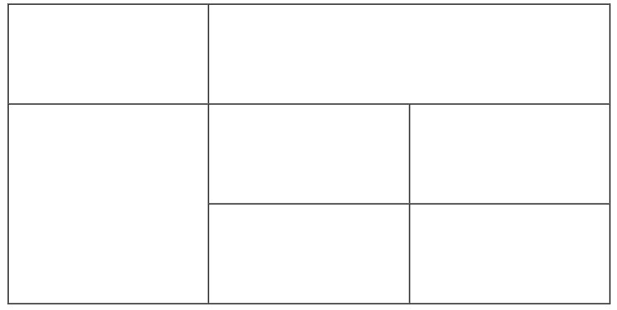

# HTML

## ch01.HTML简介

### 1. 网页

#### 1.1 什么是网页

**网站**是根据因特网上一定的规则，使用html等制作的用于展示特定内容的网页集合。

**网页**是网站中的一“页”，通常是**HTML格式的文件**，它主要通过浏览器来阅读。

**网页是构成网站的基本元素**，它通常由图片、链接、文字、声音、视频等**元素**组成。我们通常看到的网页，常见以**.htm**或**.html**后缀结尾的文件，因此将其俗称为**HTMl文件**。

#### 1.2 什么是HTML

**HTML**指的是超文本标记语言（**Hyper Text Markup Language**）,它是用来描述网页的一种语言。

HTML不是一种编程语言，而是一种**标记语言**（markup language）。 标记语言是一套标记标签（markup tag）。

**超文本的含义：**

1. 它可以加入图片、声音、动画、多媒体等内容（超越文本限制）。
2. 它可以从一个文件跳转到另一个文件，于世界各地主机的文件连接（超级链接文本）。

#### 1.3 网页的形成

网页由网页元素组成，这些元素通过html标签描述出来，然后通过浏览器解析并显示出来。


### 2. 常用的浏览器及其内核

#### 2.1 常用浏览器

浏览器是网页显示、运行的平台。

五大浏览器有 IE、Firefox、Chrome、Safari 和 Opera。

四大内核：Trident, Gecko, Webkit, Blink

#### 2.2 浏览器内核

浏览器内核（渲染引擎）：负责读取网页内容，整理讯息，计算网页的显示方式并显示页面。

| 浏览器       | 内核    | 备注                          |
| ------------ | ------- | ----------------------------- |
| IE           | Trident | IE、猎豹安全、360、百度浏览器 |
| firefox      | Gecko   | 火狐浏览器内核                |
| Safari       | Webkit  | 苹果浏览器内核                |
| Chrome/Opera | Blink   | chrome/opera 浏览器内核       |

目前国内一般浏览器都会采用Webkit/Blink内核，如360、UC、QQ、搜狗等。


### 3. Web标准（重点）

Web标准是由W3C组织和其他标准化组织制定的一系列标准的集合。W3C（万维网联盟）是国际最著名的标准化组织。

#### 3.1 为什么需要Web标准

浏览器不同，它们显示的页面或者排版有些许差异。

遵循Web标准除了可以让不同的开发人员写出的页面更标准、更统一外，还有以下优点：

1. 让Web标准发展前景更为广阔
2. 内容能被更广泛的设备访问。
3. 更容易被搜索引擎了搜索。
4. 降低网站流量费用。
5. 易于维护。
6. 提高页面浏览速度。

#### 3.2 Web标准的构成

| 标准                    | 说明                                                         |
| ----------------------- | ------------------------------------------------------------ |
| **结构** (Structure)    | 结构对**网页元素**进行整理和分类，现阶段主要是**HTML**       |
| **表现** (Presentation) | 表现用于设置网页元素的版式、颜色、大小等**外观样式**，主要是指**CSS** |
| **行为 **(Behevior)     | 行为是指网页模型的定义以及**交互**的编写，现阶段主要是**Javascript** |

Web标准提出的最佳体验方案：结构、表现、行为相分离。


## ch02. HTML标签（上）

### 1. HTML语法规范

#### 1.1 基本语法规范

1. HTML 标签是由尖括号包围的关键词，例如`<html>`。
2. HTML 标签通常是**成对**出现的，例如`<html>`和`</html>`，称为**双标签**。第一个是开始标签，第二个是结束标签。
3. 有些特殊标签必须是**单个**标签（极少情况），例如`<br/>`，我们称之为**单标签**。

#### 1.2 标签关系

标签关系可以分为两类：**包含关系**和**并列关系**

1. 包含关系

	```html
	<head>
	    <title> </title>
	</head>
	```

2. 并列关系

	```html
	<head> </head>
	<body> </body>
	```


### 2. HTML基本标签结构

每个网页都会有一个基本的结构标签（也称为骨架标签），页面内容都是在这些基本标签上书写。 HTML 页面也叫 HTML 文档。

| 标签名          | 定义       | 说明                                                   |
| --------------- | ---------- | ------------------------------------------------------ |
| <html></html>   | HTML标签   | 页面中最大的标签，我们称为根标签                       |
| <head></head>   | 文档的头部 | 注意在head中我们必须要设置的标签是title                |
| <title></title> | 文档的标题 | 让页面拥有一个属于自己的网页标题                       |
| <body></body>   | 文档的主体 | 元素包含文档的所有内容，页面内容基本都是放到body里面的 |

```html
<html>
    <head>
        <title>我的第一个页面</title>
    </head>
    <body>
        你我之间，黑马洗练，月薪过万，一飞冲天
    </body>
</html>
```

> **基本结构标签总结**
>
> 


### 3. 开发工具

#### 3.1 VScode的使用

1. 双击打开软件

2. 新建文件`Ctrl+N`

3. 保存`Ctrl+S`，注意存为`.html`文件

4. `Ctrl + +或-`可以放大或缩小页面

5. **生成页面骨架结构**。

	输入 `!` 按下Tab键或用鼠标选择

6. 利用插件在浏览器中预览页面：单机鼠标右键，在弹出窗口中点击"Open in Default Brower"


#### 3.2 VSCode工具生成骨架标签新增代码

```html
<!DOCTYPE html>
<html lang="en">
<head>
    <meta charset="UTF-8">
    <meta http-equiv="X-UA-Compatible" content="IE=edge">
    <meta name="viewport" content="width=device-width, initial-scale=1.0">
    <title>我利用vscode创建的第一个页面</title>
</head>
<body>
    写代码是一件非常快乐的事
</body>
</html>
```

1. **`<!DOCTYPE>`标签**

	`!<DOCTYPE>` 文档类型声明，告诉浏览器使用何种 HTML **版本**来显示网页。

	`<!DOCTYPE html>`**这句话的意思是：当前页面采用的是 HTML5 版本来显示网页。** **注意：**

	1. `<!DOCTYPE>` 声明位于文档**最前面**的位置，处于`<html>`标签之前。
	2. `<!DOCTYPE>` <u>不是一个 HTML 标签，他就是文档类型声明标签</u>。

	

2. **lang语言**

	用来显示当前文档显示的语言。

	1. `en` 定义语言为英文。
	2. `zh-CN` 定义语言为中文。

	其实对于文档显示来说，定义成en的文档也可以显示英文，定义成zh-CN的文档也可以显示英文。
	这个属性对浏览器和搜索引擎（百度，谷歌等）还是有作用的，如果`<html lang="en">`但内容里写的是中文，用浏览器打开时会弹出是否需要翻译。

	

3. **charset字符集**

	`<meta charset="UTF-8">` 这句话一定要写，否则容易乱码。

	字符集（character set）是多个字符的集合，以便计算机能够识别和存储各种文字。

	在`<head>`标签内，可以通过`<meta>`标签的`charset` 属性来设置文档使用何种字符编码。

	`charset`常用的值有：GBK、UTF-8，其中UTF-8被称为万国码，基本包含了全世界所有国家需要用到的字符。

	

### 4. HTML常用标签

#### 4.1 标签语义

标签语义就是标签的含义，即这个标签是用来干嘛的。

根据标签的语义，再合适的地方给一个最合理的标签，可以让页面结构更清晰。

#### 4.2 标题标签 `<h1> - <h6>` （重要）

为了使网页具有语义化，经常使用标题标签，HTML 提供 6 个等级的网页标题标签即 `<h1>-<h6>`。

```html
<h1>标题标签</h1>
<h1>标题一共六级选,</h1>
<h2>文字加粗一行显。</h2>
<h3>由大到小依次减，</h3>
<h4>从重到轻随之变。</h4>
<h5>语法规范书写后，</h5>
<h6>具体效果刷新见。</h6>
```

单词为 head 简写，从 h1-h6 依据重要性递减。

#### 4.3 段落换行标签（重要）

##### 4.3.1 段落标签

**`p`** 指**paragraph**，意为段落。把文字有条理的显示出来就需要将文字分段显示。在 html 中，`<p>` 标签用于定义段落，将整个网页分成若干个段落。

**`<p>我是一个段落标签</p>`**

**标签语义**可以把HTML文档分割为若干段落。

**特点：**

1. 文本在一个段落中会根据浏览器窗口的大小自动换行。
2. 段落和段落之间保有空隙。

##### 4.3.2 换行标签

**`<br/>`** 是 break 缩写，意为打断、换行。

标签语义： 强制换行

**特点：**

1. `<br/>` 是个<u>单标签</u>。
2. `<br/>` 标签<u>只是简单地开始新的一行</u>，跟段落不一样，<u>段落之间会插入一些垂直的间距</u>。

#### 4.4 文本格式化标签

在网页中，有时候需要为文字设置**粗体**、*斜体*或<u>下划线</u>等效果，需要使用 HTML 中的文本格式化标签，使文字以特殊方式显示。

标签语义： 突出重要性，比普通文字重要。

| 语义   | 标签                           | 说明                          |
| ------ | ------------------------------ | ----------------------------- |
| 加粗   | `<strong></strong>`或`<b></b>` | 更推荐`<strong>`，语义更强烈  |
| 斜体   | `<em></em>`或`<i></i>`         | 更推荐使用`<em>`，语义更强烈  |
| 删除线 | `<del></del>`或`<s><s/>`       | 更推荐使用`<del>`，语义更强烈 |
| 下划线 | `<ins></ins>`或`<u></u>`       | 更推荐使用`<ins>`，语义更强烈 |

#### 4.5 `<div>`和`<span>`标签

`<div>`和`<span>`是没有语义的，它们就是一个盒子，用来装内容。

```html
<div> 这是头部 </div>
<span> 今日价格 </span>
```

div 是 division 的缩写，表示分割、分区。span 意思是跨度、跨距。

**特点：**

1. div 标签用来布局，但是现在**一行只能放一个 div，大盒子**。
2. span 标签用来布局，**一行可以多个 span，小盒子**。

#### 4.6 图像标签和路径（重点）

##### 4.6.1. 图像标签

- 在 HTML 标签中，**`` **标签用于定义 HTML 标签页面中的图像。

```html

```

<u>注意右尖括号前的`/`加不加都可以</u>

单词 image 的缩写，意为图像。

**src** 是标签的<u>必须属性</u>，用于<u>指定图像文件的路径和文件名</u>。

属性： 属于这个图像标签的特性。

- 图像标签的其他属性:

| 属性     | 属性值         | 说明                               |
| -------- | -------------- | ---------------------------------- |
| `src`    | 图片路径       | 必须属性                           |
| `alt`    | 文本           | 替换文本，当图片不显示时显示文字   |
| `title`  | 文本           | 提示文本。鼠标放到图像上显示文字   |
| `width`  | 像素           | 图像宽度                           |
| `height` | 像素           | 图像高度                           |
| `border` | 像素           | 图像边框粗细                       |
| align    | 图像的对齐方式 | 如top, bottom, middle, left, right |

```html
<body>
    <h4>图像标签的使用：</h4>
    

    <h4> alt 替换文本 图像显示不出来的时候用文字替换：</h4>
    

    <h4> title提示文本 鼠标放到图像上，提示的文字：</h4>
    

    <h4> width给图像设定宽度：</h4>
    

    <h4> height给图像设定高度：</h4>
    

    <h4> border给图像设定边框：</h4>
    
</body>
```

- 图像标签注意点：

	① 图像可以拥有多个属性，必须写在标签名的后面

	② 属性之间不分先后顺序，标签名与属性、属性与属性之间均以空格分开

	③ 属性采用键值对的格式，即key="value"的格式，属性="属性值"

##### 4.6.2 路径

- 相对路径

相对路径： 以引用文件位置为参考基础，而建立出来的目录路径。是相对于 HTML 页面的位置。

| 分类       | 符号  | 说明                                                     |
| ---------- | ----- | -------------------------------------------------------- |
| 同级路径   |       | 同一级，如``                      |
| 下一级路径 | `/`   | 位于 HTML 文件上一级，如`` |
| 上一级路径 | `../` | 位于 HTML 文件下一级，如``     |

- 绝对路径

绝对路径： 是指目录下的绝对位置，直接到达目标位置，通常是从盘符开始的路径或者完整的网络地址。
如 "D:\大学\web\黑马pink前端入门笔记\前端基础第一天\和刘苗.jpg" 或完整的网络地址 "http://www.itcast.cn/images/logo.gif"

#### 4.7 超链接标签（重点）

在 HTML 标签中，**`<a/>`** 标签用于从一个页面链接到另一个页面。

##### 4.7.1 链接的语法规范

**`<a href="跳转目标" target="目标窗口的弹出方式">文本或图像</a>`**

a是anchor的缩写，意为锚。

**属性**

| 属性     | 作用                                                        |
| -------- | ----------------------------------------------------------- |
| `href`   | 指定链接地址 url，为必须属性。                              |
| `target` | 指定页面打开方式，`_self`为默认值，`_blank`为在新窗口中打开 |

##### 4.7.2 链接的分类

1. 外部链接
2. 内部链接：网站内部页面之间的相互链接。
3. 空链接: 如果当时没有确定链接目标时，`<a href="#">首页</a>`
4. 下载链接：如果href里面地址是一个文件或压缩包，会下载这个文件。地址链接的是文件.exe、压缩包.zip 等。
5. 网页元素链接：在网页中的各种网页元素。如文本、图像、表格、音频、视频等。
6. 锚点链接：点击链接，可以快速定位到页面中的某个位置。
	- 在链接文本的`href`属性中，设置属性为**#名字**的形式（取个名字），如**`<a href="#two">第2集</a>`**
	- 找到目标位置标签，里面添加一个 id 属性 = 名字，如**`<h3 id="two">第2集介绍</h3>`**

`Tip` 阻止 `a` 链接跳转，课可给 `href` 属性设置 `javascript:void(0);` 或者 `javascript:;`。


### 5. HTML中的注释和特殊字符

1. **注释**

	HTML中注释以 **"<!--" ** 开头，以 **"-->"**结束。

	**`<!-- 注释语句 -->`**

	快捷键：`Ctrl + /`

2. **特殊字符**

	| 特殊字符 | 描述     | 字符的代码                           |
	| -------- | -------- | ------------------------------------ |
	|          | 空格符   | **`&nbsp;`**  (*Non Breaking Space*) |
	| <        | 小于号   | **`&lt;`**                           |
	| >        | 大于号   | **`&gt;`**                           |
	| ""       | 引号     | `<blockquote></blockquote>`          |
	| &        | 和号     | `&amp;`                              |
	| ¥        | 人民币   | `&yen;`                              |
	| ©        | 版权     | `&copy;`                             |
	| ®        | 注册商标 | `&reg;`                              |
	| °        | 摄氏度   | `&deg;`                              |
	| ±        | 正负号   | `&plusmn;`                           |
	| ×        | 乘号     | `&times;`                            |
	| ÷        | 除号     | `&divide;`                           |
	| ²        | 平方     | `&sup2;`                             |
| ³        | 立方     | `&sup3;`                             |
	
	`&`开头`;`结尾


## ch03. HTML标签（下）

### 1. 表格标签

#### 1.1 表格的主要作用

表格主要用于显示、展示数据，因为可以让数据显示非常规整，可读性好。 表格不是来布局的，而是来展示数据的。

#### 1.2 表格的基本语法

```html
<table>
    <tr>
        <td>单元格内的文字</td>
        ...
    </tr>
</table>
```

1. **`<table></table>`** 用于定义表格的标签。
2. **`<tr></tr>`** 标签用于定义表格中的**行**，必须嵌套在 **`<table></table>`**中。(table row)
3. **`<td></td>`** 用于定义表格中的**单元格**，必须嵌套在 **`<tr></tr>`** 中。没有列，一行有几个单元格就是几列。
4. 字母 td 指表格数据（table data），即单元格的内容。

#### 1.3 表头单元格标签

一般表头单元格位于表格的第一行或第一列，表格单元格里面的文本内容**加粗居中显示**。 

**`<th>`** 标签表示 HTML 表格的表头部分（table head 的缩写） 

表头单元格(`<th>`)也是单元格，常用于表格第一行，突出重要性，表头单元格里面的文字会加粗居中显示。

```html
<table>
    <tr>
        <th>姓名</th>
        ...
    </tr>
</table>
```

#### 1.4 表格属性

只作了解，不常用，后期通过 CSS 来设置。 这些属性都要写到 `<table></table>` 标签中

| 属性名        | 属性值              | 描述                                     |
| ------------- | ------------------- | ---------------------------------------- |
| `align`       | left、center、right | 表格元素对齐方式（在页面的左中右）       |
| `border`      | 1 或""              | 规定是否有边框，默认为`""`，表示没有边框 |
| `cellpadding` | 像素值              | 规定单元边沿与其内容之间空白，默认 1px   |
| `cellspacing` | 像素值              | 规定单元格之间的空白，默认为 2px         |
| `width`       | 像素值或百分比      | 规定表格宽度                             |
| `hight`       | 像素                | 表格高度                                 |

#### 1.5 表格结构标签

场景：表格可能很长，将表格分割为表格**头部**和表格**主题**两大部分。

加强语义化：**`<thead>`** 表示头部区域，**`<tbody>`** 表示主体区域，更好区分表格结构。

注意：

1. `<thead></thead>`：定义表格头部，且<u>内部必须有`<tr>`标签。</u>
2. `<tbody></tbody>`：定义表格主体，存放数据本体。
3. 以上标签都放在 `<table></table>` 里面。

#### 1.6 合并单元格

1. 合并单元格方式：

	- 跨行合并：**rowspan**="合并单元格个数"

	- 跨列合并：**colspan**="合并单元格个数"

2. 目标单元格（写合并代码）
	- **跨行**：**最上侧**单元格为目标单元格，写合并代码
	- **跨列**：**最左侧**单元格为目标单元格，写合并代码

3. 合并三部曲：

	1. 确定跨行 or 跨列。
	2. 找到目标单元格：跨行取最上面为目标单元格，跨列取最左边为目标单元格。`<td colspan="2"></td>`
	3. 删除多余单元格。

	> 如：
	>
	> ```html
	> <body>
	>     <table width="500" height="249" border="1" cellspacing="0">
	>         <tr>
	>             <td></td>
	>             <td colspan="2"></td>
	>             <!-- <td></td> 删除多余单元格-->
	>         </tr>
	>         <tr>
	>             <td rowspan="2"></td>
	>             <td></td>
	>             <td></td>
	>         </tr>
	>         <tr>
	>             <!-- <td></td> -->
	>             <td></td>
	>             <td></td>
	>         </tr>
	>     </table>
	> </body>
	> ```
	>
	> 效果：
	>
	> 


### 2. 列表标签

表格展示数据，列表则用来布局。 列表特点是整齐、整洁、有序，作为布局更方便自由。 根据使用场景不同，列表分为三大类：

- 无序列表
- 有序列表
- 自定义列表。

#### 2.1 无序列表（重点）

**`<ul>`** (unordered lists) 标签表示HTML页面中项目的**无序列表**，一般会以项目符号呈现列表项，而**列表项**使用**`<li>`** (list item) 标签定义。

```html
<ul>
    <li>列表项1</li>
    <li>列表项2</li>
    <li>列表项3</li>
    ...
</ul>
```

`<ul></ul>`中只能嵌套`<li></li>`，不能直接在`<ul></ul>`标签中输入其他标签或文字。

`<li></li>`之间相当于一个容器，可以容纳所有元素。

#### 2.2 有序列表（理解）

使用 **`<ol>`**  (ordered lists) 标签来定义有序列表，**`<li>`** 来定义列表项。

```html
<ol>
    <li>列表项1</li>
    <li>列表项2</li>
    <li>列表项3</li>
    ...
</ol>
```

`<ol></ol>`中只能嵌套`<li></li>`，不能直接在`<ol></ol>`标签中输入其他标签或文字。

`<li></li>`之间相当于一个容器，可以容纳所有元素。

#### 2.3 自定义标签（重点）

自定义列表常用于对术语或名词进行解释和描述，定义列表的列表项前没有任何项目的符号。

**`<dl>`** (definition lists) 标签用于定义列表，该标签会与**`<dt>`** (definition term)（定义项目/名字）和**`<dd>`** (definition description)（描述每一个项目/名字）一起使用。

```html
<dl>
    <dt>名词1</dt>
    <dd>名词1解释1</dd>
    <dd>名词1解释2</dd>
</dl>
```

1. `<dl></dl>`里面只能包含`<dt>`和`<dd>`
2. `<dt>`和`<dd>`个数没有限制，经常是一个`<dt>`对应多个`<dd>`

#### 2.4 列表总结

| 标签名          | 定义       | 说明                                                         |
| --------------- | ---------- | ------------------------------------------------------------ |
| **`<ul></ul>`** | 无序标签   | 里面只能包含`<li></li>`，没有顺序，使用较多。`<li></li>`里面可以包含任何标签。 |
| **`<ol></ol>`** | 有序标签   | 里面只能包含`<li></li>`，有顺序，使用较少。`<li></li>`里面可以包含任何标签。 |
| **`<dl></dl>`** | 自定义标签 | 里面只能包含`<dt></dt>`和`<dd>/<dd>`。`<dt></dt>`和`<dd>/<dd>`里面可以包含任何标签。 |


### 3. 表单标签

#### 3.1 为什么需要表单

为了收集用户信息。

#### 3.2 表单的组成

- 表单域
- 表单控件（也称为表单元素）
- 提示信息

#### 3.3 表单域

表单域是一个包含表单元素的区域，以实现用户信息的收集和传递。

**`<form>`**会把它范围内的表单元素信息提交给服务器。

```html
<form action="url地址" method="提交方式" name="表单域名称">
    各种表单元素控件
</form>
```

**常用属性**

| 属性   | 属性值   | 作用                                               |
| ------ | -------- | -------------------------------------------------- |
| action | url地址  | 用于指定接收并处理表单数据的服务器程序的url地址    |
| method | get/post | 用于设置表单数据的提交方式，其值为get或post        |
| name   | 名称     | 用于指定表单的名称，以区分同一个页面中的多个表单域 |

暂时不用表单域提交数据，只需要写上form标签。

1. 写表单元素之前应该有个表单域把他们包含
2. 表单域是form标签

#### 3.4 表单控件（元素）

允许用户在表单中输入或选择的内容控件。

##### 3.4.1 `<input>`表单元素

用于收集用户信息。

```html
<input type="属性值" />
```

根据不同的type属性，输入字段拥有很多形式（可以是文本字段、复选框、掩码后的文本控件、单选按钮、按钮等）。

- `<input />`标签为单标签

- type属性设置不同的属性值用来指定不同的控件类型

  type属性的属性值及其描述：

  

  除type属性外，`<input>`标签还有其他很多属性，其常用属性如下：

  | 属性      | 属性值       | 描述                                |
  | --------- | ------------ | ----------------------------------- |
  | name      | 由用户自定义 | 定义input元素的名称                 |
  | value     | 由用户自定义 | 定义input元素的值                   |
  | checked   | checked      | 规定此input元素首次加载时应当被选中 |
  | maxlength | 正整数       | 规定输入字段中的字符的最大长度      |

  1. name和value是每个表单元素都有的属性值，主要给后台人员使用。value只在文本框中能看到效果，在其余中没有显示出来。

  	name属性：当前input表单的名字，后台可以通过这个name属性找到表单。页面中的表单很多，name的主要作用就是用于区别不同的表单。

  	```html
  	用户名：<input type="text" value="请输入用户名" name="username" />
  	```

  	- name属性后面的值是自定义的

  	- radio（或者checkbox）如果是一组，必须给他们命名相同的名字

  		```html
  		<input type="radio" name="sex" />男
  		<input type="radio" name="sex" />女
  		```

  2. name 表单元素的名字，要求**单选按钮和复选框要有相同的name值**

  3. **checked**属性主要针对于**单选按钮**和**复选框**，主要作用：一打开页面，就默认选中某个表单元素

  4. maxlength是用户可以在表单元素输入的最大字符数，一般较少使用

### 4. 综合案例


### 5. 查阅文档

